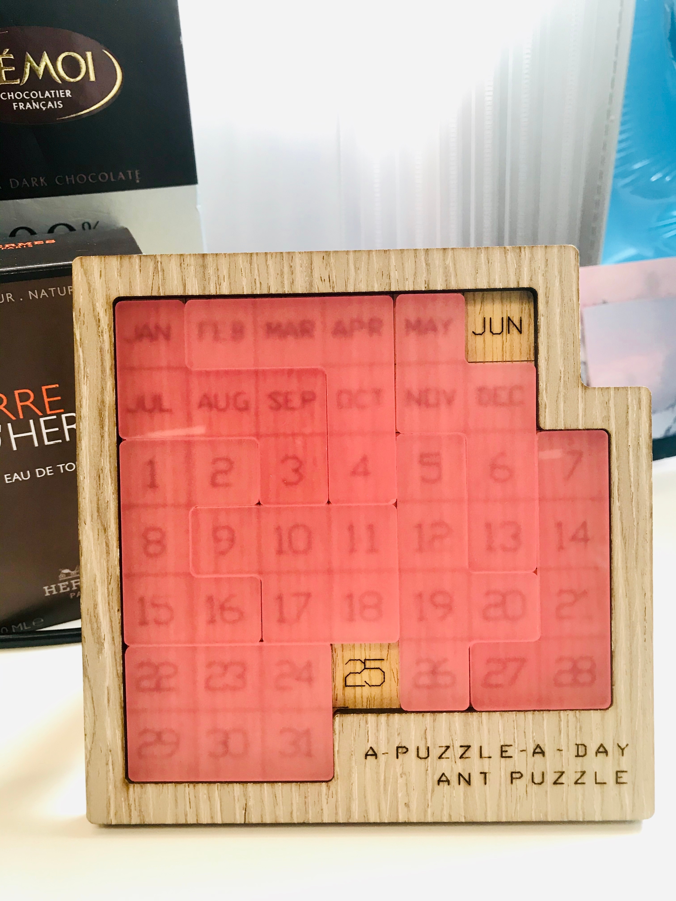

# a-puzzle-a-day

Solver for a-puzzle-a-day, powered by jandan.net.


[](LICENSE)

### Install
```shell
> go get github.com/gonejack/a-puzzle-a-day
```

### Usage
```shell
> a-puzzle-a-day jun 26
```


### *Fish picture from jandan*

